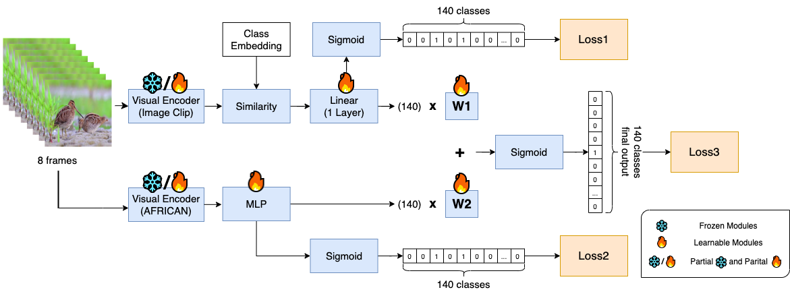

# Official Implementation of AFRICAN


# Preparation
1. Download the Dataset from their [official site](https://github.com/sutdcv/Animal-Kingdom), or use the following script with the file_id from the google drive to download.
    ```
    # AR_metadata.xlsx
    mkdir -p <path_to_dataset>/action_recognition/
    gdown '<file_id>&confirm=t' -O /storage/AnimalKingdom/action_recognition/AR_metadata.xlsx

    # video.tar.gz
    mkdir -p <path_to_dataset>/action_recognition/dataset
    gdown '<file_id>&confirm=t' -O /storage/AnimalKingdom/action_recognition/dataset/video.tar.gz
    tar -xzf <path_to_dataset>/action_recognition/dataset/video.tar.gz -C <path_to_dataset>/action_recognition/dataset/

    # df_action.xlsx, train.csv and val.csv
    mkdir -p <path_to_dataset>/action_recognition/annotation
    gdown '<file_id>&confirm=t' -O /storage/AnimalKingdom/action_recognition/annotation/df_action.xlsx
    gdown '<file_id>&confirm=t' -O /storage/AnimalKingdom/action_recognition/annotation/train.csv
    gdown '<file_id>&confirm=t' -O /storage/AnimalKingdom/action_recognition/annotation/val.csv
    ```

2. Fix one video: There is one boken video: ZAKHHVKA.mp4. You can either reprocess it from the image.tar.gz provided by the offitial dataset, or use my preprocessed one.
    ```
    gdown '1Dhw5kTk8-T3vPv6wjfaOi4efOgWJPGjI&confirm=t' -O <path_to_dataset>/action_recognition/dataset/video/ZAKHHVKA.mp4
    ```

3. download the pretrained weights: InternVideo-MM-L-14.ckpt, b8cca3fd41ae0c99ba7e8951adf17d267cdb84cd88be6f7c2e0eca1737a03836/ViT-L-14.pt, and AFRICAN_pretrain.pt
    ```
    !mkdir -p <path_to_repo>/Train/weights/

    # InternVideo-MM-L-14.ckpt
    wget -P <path_to_repo>/Train/weights/ https://pjlab-gvm-data.oss-cn-shanghai.aliyuncs.com/internvideo/pretrain/InternVideo-MM-L-14.ckpt

    # ViT-L-14.pt
    wget -P <path_to_repo>/Train/weights/ https://openaipublic.azureedge.net/clip/models/b8cca3fd41ae0c99ba7e8951adf17d267cdb84cd88be6f7c2e0eca1737a03836/ViT-L-14.pt

    # africa_pretrain.ckpt
    gdown '1C7pNJIyfkPGK0YJcZh94shwa2FhQoojd&confirm=t' -O <path_to_repo>/Train/weights/africa_pretrain.ckpt
    ```

# Requirements
```
decord==0.6.0
ftfy==6.1.1
timm==0.9.2
pytorch-lightning==2.0.2
einops==0.6.1
ipdb==0.13.13
demoji==1.1.0
sacred==0.8.4
editdistance==0.6.2
tslearn==0.5.3.2
attrs==23.1.0
ffmpeg==1.4
transformers==4.29.2
importlib-metadata==6.6.0
pytorchvideo==0.1.5
torchmetrics
openpyxl==3.1.2
```
# Pretrained Weight
- AFRICAN-AR: https://drive.google.com/file/d/1-13Spd3yWsFON21TRLLqVWue5s1rOpmA/view?usp=sharing
- Scripts
    ```
    !python3 Train/evaluation.py with \
    'data_dir="<path_to_dataset>/action_recognition"' \
    'train_laryers="vision_proj"' \
    'device="cuda"' 'data_workers=8' 'transformer_proj_vc=False' \
    'enable_video_clip=False' 'enable_image_clip=True' 'enable_african=True' \
    'ckpt_path="<path-to-AFRICAN-AR.ckpt>"'
    ```

# Training Script
1. basic
    ```
    python3 Train/train.py with <hyper_parameters>
    ```

2. example
    ```
    import wandb
    wandb.login(key=<wandb_key>)

    python3 Train/train.py with 'name="<experiment_name>"' \
    'data_dir="<path_to_dataset>/action_recognition"' \
    'train_laryers="vision_proj"' 'transformer_proj_vc=False' \
    'max_epochs=100' 'device="cuda"' 'data_workers=12' \
    'enable_video_clip=False' 'enable_image_clip=True' 'enable_african=True' \
    'loss="BCE"' 'decay_power="no_decay"' 'batch_size=128' 'lr=0.00015' 
    ```

3. configurations:
    - loss: select from {"BCE", "FOCAL", "LDAM", "EQL"}
    - train_laryers: 
        - vision: all video encoders trainable
        - vision_proj: only project layers trainable
        - vision_dd_proj: vision_proj with two more Uniformer V2 modules trainable (C_MHRA and DPE)
        - vision_tn4_proj: vision_dd_proj with ViT's last 4 laters trainable.
    - enable_video_clip: for stream controlling
    - enable_image_clip: for stream controlling
    - enable_african: for stream controlling
    - transformer_proj_vc: add post-transformer layers after ViT.
    - ckpt_path_ic: path to ViT-L-14.pt
    - ckpt_path_af: path to africa_pretrain.ckpt
    - ckpt_path_imageclip_vc: path to ViT-L-14.pt
    - ckpt_path_videoclip_vc: path to InternVideo-MM-L-14.ckpt

# Other Training Branches
1. master: The main architecture in this research.
2. VCICAFLs1at_t1: master with different weighting scheme with w for VCIC stream and (1-w) for AF stream, instead of w1, w2 and bias.
3. VCICAFLs1at_crossattn: MSQNet architecture with VideoCLip backbone.
4. timesformer_crossattn: MSQNet architecture with TimeSformer backbone.
5. VCICAFL_preaug: preprocess video into embeddings for ImageCLIP.

# plot text embedding
1. install pdflatex
    ```
    sudo apt-get update
    sudo apt-get install -y texlive-latex-base
    sudo apt-get install -y texlive-fonts-recommended
    sudo apt-get install -y texlive-fonts-extra
    sudo apt-get install -y texlive-latex-extra
    ```

2. scripts
    ```
    python3 AnimalKingdomCLIP/Train/plot_text_embedding.py with 'device="cuda"' \
    'data_dir="/storage/AnimalKingdom/action_recognition"'
    ```

3. convert pgf to pdf 
    ```
    bash Train/tool_scripts/convert_pgf_to_pdf.sh 
    ```